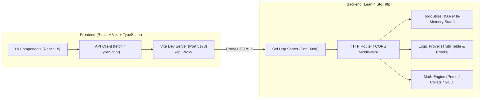

# lean4-web

Lean 4 기반 웹 통신 구현 및 풀스택 애플리케이션

이 프로젝트는 **Lean 4 공식 표준 비동기 웹 서버(`Std.Http`)** 기반의 백엔드와 **React 18 + Vite + TypeScript** 기반의 프론트엔드로 구성된 풀스택 웹 애플리케이션입니다.

---

## 🏛 아키텍처 개요



---

## 🚀 주요 기능

1. **Lean 4 비동기 HTTP 서버 (`Std.Http`)**:
   - `Std.Http.Server`를 사용한 고성능 비동기 HTTP/1.1 웹 서버
   - CORS 프리플라이트(`OPTIONS`) 지원 및 JSON 직렬화/역직렬화 (`Lean.Data.Json`)

2. **할 일 관리 (Concurrency & State)**:
   - Lean 4의 `IO.Ref`를 활용한 스레드 세이프 인메모리 상태 관리
   - 실시간 할 일 조회(`GET /api/todos`), 추가(`POST /api/todos`), 완료 토글(`POST /api/todos/toggle`), 삭제(`POST /api/todos/delete`)

3. **명제 논리 검증기 (Formal Logic Verifier)**:
   - 전건 긍정식(Modus Ponens), 드 모르간 법칙, 배중률, 피어스의 법칙, 후건 긍정의 오류 등 명제 검증
   - 전체 진리표(Truth Table) 자동 생성, 항진식(Tautology) 및 충족 가능성(Satisfiability) 판별, 반례(Counterexample) 감지
   - 실제 Lean 4 형식 증명(Theorem Proof) 스케치 제공

4. **수론 및 알고리즘 계산 엔진 (Math Engine)**:
   - **소수 판별 & 소인수분해**: 순수 함수형 소수 판별 및 소인수 분해
   - **콜라츠 추측 (3n+1)**: 단계별 시퀀스 추적, 도달 단계(Step Count) 및 최대값(Peak) 계산
   - **피보나치 수열**: F(0) ~ F(N) 생성
   - **확장 유클리드 호제법**: 최대공약수(GCD) 계산, 단계별 나눗셈 과정, 베주 항등식(Bézout's identity: $a \cdot x + b \cdot y = \gcd(a, b)$) 정수해 계산

5. **인터랙티브 API 테스터**:
   - 프론트엔드 내에서 백엔드 REST API를 즉시 호출하고 실시간 JSON 응답 확인

---

## 🛠 실행 방법

### 사전 요구사항
- **Lean 4** (elan v4.34.0 권장)
- **Node.js** (v18+) 및 **npm**

### ⚙️ 포트 환경설정 (.env)

프로젝트 루트의 `.env` 파일을 통해 백엔드와 프론트엔드의 포트를 자유롭게 변경할 수 있습니다:

```env
# 백엔드 서버 포트 (Lean 4 Std.Http)
BACKEND_PORT=8080

# 프론트엔드 개발 서버 포트 (React-Vite)
FRONTEND_PORT=5173
```

> [!TIP]
> - 포트 8080이 이미 사용 중이라면 `.env` 파일에서 `BACKEND_PORT=8081` 등으로 변경하기만 하면 백엔드와 프론트엔드(프록시)에 모두 즉시 자동 반영됩니다.
> - 커맨드라인 인자로 직접 지정할 수도 있습니다: `lake exe backend 8081`

### 1. 백엔드 실행 (Lean 4)
```bash
# 백엔드 디렉토리로 이동
cd backend

# 빌드 및 실행 (.env의 BACKEND_PORT 적용)
lake build
lake exe backend
```
서버가 `http://127.0.0.1:8080` (또는 `.env`에 설정된 포트)에서 시작됩니다.

### 2. 프론트엔드 실행 (React + Vite + TS)
```bash
# 별도 터미널에서 프론트엔드 디렉토리로 이동
cd frontend

# 의존성 설치 (최초 1회)
npm install

# 개발 서버 시작 (.env의 FRONTEND_PORT 적용)
npm run dev
```
브라우저에서 `http://localhost:5173` (또는 `.env`에 설정된 포트)로 접속합니다. 프론트엔드는 `.env`의 `BACKEND_PORT`로 API 요청을 자동 프록시합니다.

---

## 📡 API 엔드포인트 목록

| 메서드 | 엔드포인트 | 설명 |
|---|---|---|
| `GET` | `/api/health` | 서버 상태 및 Lean 버전 확인 |
| `GET` | `/api/info` | 시스템 및 지원 기능 정보 |
| `GET` | `/api/todos` | 할 일 목록 조회 |
| `POST` | `/api/todos` | 새 할 일 등록 (`{ text, category }`) |
| `POST` | `/api/todos/toggle` | 할 일 완료 여부 토글 (`{ id }`) |
| `POST` | `/api/todos/delete` | 할 일 삭제 (`{ id }`) |
| `POST` | `/api/logic/verify` | 명제 논리 검증 및 진리표 생성 (`{ preset }`) |
| `POST` | `/api/math/compute` | 수론 알고리즘 계산 (`{ type, ... }`) |

---

## 📁 디렉토리 구조

```
lean4-web/
├── backend/                  # Lean 4 백엔드
│   ├── Backend/
│   │   ├── Logic.lean        # 명제 논리 AST, 진리표, 증명 스케치
│   │   ├── Math.lean         # 수론 알고리즘 (소수, 콜라츠, GCD 등)
│   │   └── Todo.lean         # IO.Ref 상태 관리
│   ├── Backend.lean          # 라이브러리 루트 모듈
│   ├── Main.lean             # Std.Http 서버 및 라우팅
│   ├── lakefile.lean         # Lake 빌드 설정
│   └── lean-toolchain        # Lean 4.34.0
├── frontend/                 # React + Vite + TypeScript 프론트엔드
│   ├── src/
│   │   ├── components/
│   │   │   ├── TodoSection.tsx    # 할 일 관리 컴포넌트
│   │   │   ├── LogicSection.tsx   # 명제 논리 검증 컴포넌트
│   │   │   ├── MathSection.tsx    # 수론 계산기 컴포넌트
│   │   │   └── InfoSection.tsx    # 시스템 사양 및 API 테스터
│   │   ├── api.ts            # API 클라이언트 함수
│   │   ├── types.ts          # TypeScript 인터페이스
│   │   ├── App.tsx           # 메인 애플리케이션
│   │   └── index.css         # 다크 테마 스타일링
│   ├── vite.config.ts        # /api 프록시 설정
│   └── package.json
├── package.json              # 루트 통합 스크립트
└── README.md
```
